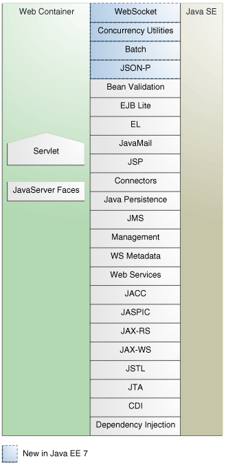
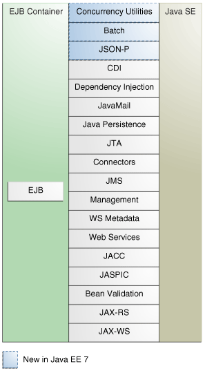
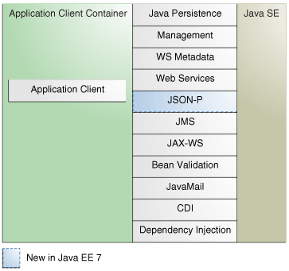

[Go to primary content](#BEGIN)

<table>
<colgroup>
<col width="50%" />
<col width="50%" />
</colgroup>
<tbody>
<tr class="odd">
<td><strong>Java Platform, Enterprise Edition The Java EE Tutorial</strong> 
<strong>Release 7 Java Platform, Enterprise Edition</strong> 
E39031-02</td>
<td><table>
<tbody>
<tr class="odd">
<td> </td>
<td><a href="toc.md"> 
Contents</a></td>
</tr>
</tbody>
</table></td>
</tr>
</tbody>
</table>

-----

<table>
<tbody>
<tr class="odd">
<td><a href="overview007.md"> 
Previous</a> </td>
<td><a href="overview009.md"> 
Next</a></td>
<td> </td>
</tr>
</tbody>
</table>

# 1.8 Java EE 7 APIs

[Figure 1-6](#BNACK) shows the relationships among the Java EE
containers.

Figure 1-6 Java EE Containers

  
[Description of "Figure 1-6 Java EE
Containers"](img_text/jeett_dt_006.md)  
  

[Figure 1-7](#GJQMG) shows the availability of the Java EE 7 APIs in the
web container.

Figure 1-7 Java EE APIs in the Web Container

  
[Description of "Figure 1-7 Java EE APIs in the Web
Container"](img_text/jeett_dt_007.md)  
  

[Figure 1-8](#GJQMN) shows the availability of the Java EE 7 APIs in the
EJB container.

Figure 1-8 Java EE APIs in the EJB Container

  
[Description of "Figure 1-8 Java EE APIs in the EJB
Container"](img_text/jeett_dt_008.md)  
  

[Figure 1-9](#GJQNH) shows the availability of the Java EE 7 APIs in the
application client container.

Figure 1-9 Java EE APIs in the Application Client Container

  
[Description of "Figure 1-9 Java EE APIs in the Application Client
Container"](img_text/jeett_dt_009.md)  
  

The following sections give a brief summary of the technologies required
by the Java EE platform and the APIs used in Java EE applications.

## 1.8.1 Enterprise JavaBeans Technology

An Enterprise JavaBeans (EJB) component, or enterprise bean, is a body
of code that has fields and methods to implement modules of business
logic. You can think of an enterprise bean as a building block that can
be used alone or with other enterprise beans to execute business logic
on the Java EE server.

Enterprise beans are either session beans or message-driven beans.

  - A session bean represents a transient conversation with a client.
    When the client finishes executing, the session bean and its data
    are gone.

  - A message-driven bean combines features of a session bean and a
    message listener, allowing a business component to receive messages
    asynchronously. Commonly, these are Java Message Service (JMS)
    messages.

In the Java EE 7 platform, new enterprise bean features include the
following:

  - Asynchronous local session beans in EJB Lite

  - Nonpersistent timers in EJB Lite

The Java EE 7 platform requires Enterprise JavaBeans 3.2 and
Interceptors 1.2. The Interceptors specification is part of the EJB
specification.

## 1.8.2 Java Servlet Technology

Java Servlet technology lets you define HTTP-specific servlet classes. A
servlet class extends the capabilities of servers that host applications
accessed by way of a request-response programming model. Although
servlets can respond to any type of request, they are commonly used to
extend the applications hosted by web servers.

In the Java EE 7 platform, new Java Servlet technology features include
the following:

  - Nonblocking I/O

  - HTTP protocol upgrade

The Java EE 7 platform requires Servlet 3.1.

## 1.8.3 JavaServer Faces Technology

JavaServer Faces technology is a user interface framework for building
web applications. The main components of JavaServer Faces technology are
as follows:

  - A GUI component framework.

  - A flexible model for rendering components in different kinds of HTML
    or different markup languages and technologies. A `Renderer` object
    generates the markup to render the component and converts the data
    stored in a model object to types that can be represented in a view.

  - A standard `RenderKit` for generating HTML 4.01 markup.

The following features support the GUI components:

  - Input validation

  - Event handling

  - Data conversion between model objects and components

  - Managed model object creation

  - Page navigation configuration

  - Expression Language (EL)

All this functionality is available using standard Java APIs and
XML-based configuration files.

In the Java EE 7 platform, new features of JavaServer Faces technology
include the following:

  - HTML5-friendly markup

  - Faces Flows

  - Resource library contracts

The Java EE 7 platform requires JavaServer Faces 2.2 and Expression
Language 3.0.

## 1.8.4 JavaServer Pages Technology

JavaServer Pages (JSP) technology lets you put snippets of servlet code
directly into a text-based document. A JSP page is a text-based document
that contains two types of text:

  - Static data, which can be expressed in any text-based format, such
    as HTML or XML

  - JSP elements, which determine how the page constructs dynamic
    content

For information about JSP technology, see the The Java EE 5 Tutorial at
`http://docs.oracle.com/javaee/5/tutorial/doc/`.

The Java EE 7 platform requires JavaServer Pages 2.3 for compatibility
with earlier releases but recommends the use of Facelets as the display
technology in new applications.

## 1.8.5 JavaServer Pages Standard Tag Library

The JavaServer Pages Standard Tag Library (JSTL) encapsulates core
functionality common to many JSP applications. Instead of mixing tags
from numerous vendors in your JSP applications, you use a single,
standard set of tags. This standardization allows you to deploy your
applications on any JSP container that supports JSTL and makes it more
likely that the implementation of the tags is optimized.

JSTL has iterator and conditional tags for handling flow control, tags
for manipulating XML documents, internationalization tags, tags for
accessing databases using SQL, and tags for commonly used functions.

The Java EE 7 platform requires JSTL 1.2.

## 1.8.6 Java Persistence API

The Java Persistence API (JPA) is a Java standards–based solution for
persistence. Persistence uses an object/relational mapping approach to
bridge the gap between an object-oriented model and a relational
database. The Java Persistence API can also be used in Java SE
applications outside of the Java EE environment. Java Persistence
consists of the following areas:

  - The Java Persistence API

  - The query language

  - Object/relational mapping metadata

The Java EE 7 platform requires Java Persistence API 2.1.

## 1.8.7 Java Transaction API

The Java Transaction API (JTA) provides a standard interface for
demarcating transactions. The Java EE architecture provides a default
auto commit to handle transaction commits and rollbacks. An auto commit
means that any other applications that are viewing data will see the
updated data after each database read or write operation. However, if
your application performs two separate database access operations that
depend on each other, you will want to use the JTA API to demarcate
where the entire transaction, including both operations, begins, rolls
back, and commits.

The Java EE 7 platform requires Java Transaction API 1.2.

## 1.8.8 Java API for RESTful Web Services

The Java API for RESTful Web Services (JAX-RS) defines APIs for the
development of web services built according to the Representational
State Transfer (REST) architectural style. A JAX-RS application is a web
application that consists of classes packaged as a servlet in a WAR file
along with required libraries.

The Java EE 7 platform requires JAX-RS 2.0.

## 1.8.9 Managed Beans

Managed Beans, lightweight container-managed objects (POJOs) with
minimal requirements, support a small set of basic services, such as
resource injection, lifecycle callbacks, and interceptors. Managed Beans
represent a generalization of the managed beans specified by JavaServer
Faces technology and can be used anywhere in a Java EE application, not
just in web modules.

The Managed Beans specification is part of the Java EE 7 platform
specification (JSR 342). The Java EE 7 platform requires Managed Beans
1.0.

## 1.8.10 Contexts and Dependency Injection for Java EE

Contexts and Dependency Injection for Java EE (CDI) defines a set of
contextual services, provided by Java EE containers, that make it easy
for developers to use enterprise beans along with JavaServer Faces
technology in web applications. Designed for use with stateful objects,
CDI also has many broader uses, allowing developers a great deal of
flexibility to integrate different kinds of components in a loosely
coupled but typesafe way.

The Java EE 7 platform requires CDI 1.1.

## 1.8.11 Dependency Injection for Java

Dependency Injection for Java defines a standard set of annotations (and
one interface) for use on injectable classes.

In the Java EE platform, CDI provides support for Dependency Injection.
Specifically, you can use injection points only in a CDI-enabled
application.

The Java EE 7 platform requires Dependency Injection for Java 1.0.

## 1.8.12 Bean Validation

The Bean Validation specification defines a metadata model and API for
validating data in JavaBeans components. Instead of distributing
validation of data over several layers, such as the browser and the
server side, you can define the validation constraints in one place and
share them across the different layers.

The Java EE 7 platform requires Bean Validation 1.1.

## 1.8.13 Java Message Service API

The Java Message Service (JMS) API is a messaging standard that allows
Java EE application components to create, send, receive, and read
messages. It enables distributed communication that is loosely coupled,
reliable, and asynchronous.

In the platform, new features of JMS include the following.

  - A new, simplified API offers a simpler alternative to the previous
    API. This API includes a `JMSContext` object that combines the
    functions of a `Connection` and a `Session`.

  - All objects with a `close` method implement the
    `java.lang.Autocloseable` interface so that they can be used in a
    Java SE 7 `try`-with-resources statement.

The Java EE 7 platform requires JMS 2.0.

## 1.8.14 Java EE Connector Architecture

The Java EE Connector Architecture is used by tools vendors and system
integrators to create resource adapters that support access to
enterprise information systems that can be plugged in to any Java EE
product. A resource adapter is a software component that allows Java EE
application components to access and interact with the underlying
resource manager of the EIS. Because a resource adapter is specific to
its resource manager, a different resource adapter typically exists for
each type of database or enterprise information system.

The Java EE Connector Architecture also provides a performance-oriented,
secure, scalable, and message-based transactional integration of Java EE
platform–based web services with existing EISs that can be either
synchronous or asynchronous. Existing applications and EISs integrated
through the Java EE Connector Architecture into the Java EE platform can
be exposed as XML-based web services by using JAX-WS and Java EE
component models. Thus JAX-WS and the Java EE Connector Architecture are
complementary technologies for enterprise application integration (EAI)
and end-to-end business integration.

The Java EE 7 platform requires Java EE Connector Architecture 1.7.

## 1.8.15 JavaMail API

Java EE applications use the JavaMail API to send email notifications.
The JavaMail API has two parts:

  - An application-level interface used by the application components to
    send mail

  - A service provider interface

The Java EE platform includes the JavaMail API with a service provider
that allows application components to send Internet mail.

The Java EE 7 platform requires JavaMail 1.5.

## 1.8.16 Java Authorization Contract for Containers

The Java Authorization Contract for Containers (JACC) specification
defines a contract between a Java EE application server and an
authorization policy provider. All Java EE containers support this
contract.

The JACC specification defines `java.security.Permission` classes that
satisfy the Java EE authorization model. The specification defines the
binding of container-access decisions to operations on instances of
these permission classes. It defines the semantics of policy providers
that use the new permission classes to address the authorization
requirements of the Java EE platform, including the definition and use
of roles.

The Java EE 7 platform requires JACC 1.5.

## 1.8.17 Java Authentication Service Provider Interface for Containers

The Java Authentication Service Provider Interface for Containers
(JASPIC) specification defines a service provider interface (SPI) by
which authentication providers that implement message authentication
mechanisms may be integrated in client or server message-processing
containers or runtimes. Authentication providers integrated through this
interface operate on network messages provided to them by their calling
containers. The authentication providers transform outgoing messages so
that the source of each message can be authenticated by the receiving
container, and the recipient of the message can be authenticated by the
message sender. Authentication providers authenticate each incoming
message and return to their calling containers the identity established
as a result of the message authentication.

The Java EE 7 platform requires JASPIC 1.1.

## 1.8.18 Java API for WebSocket

WebSocket is an application protocol that provides full-duplex
communications between two peers over TCP. The Java API for WebSocket
enables Java EE applications to create endpoints using annotations that
specify the configuration parameters of the endpoint and designate its
lifecycle callback methods.

The WebSocket API is new to the Java EE 7 platform. The Java EE 7
platform requires Java API for WebSocket 1.0.

## 1.8.19 Java API for JSON Processing

JSON is a text-based data exchange format derived from JavaScript that
is used in web services and other connected applications. The Java API
for JSON Processing (JSON-P) enables Java EE applications to parse,
transform, and query JSON data using the object model or the streaming
model.

JSON-P is new to the Java EE 7 platform. The Java EE 7 platform requires
JSON-P 1.0.

## 1.8.20 Concurrency Utilities for Java EE

Concurrency Utilities for Java EE is a standard API for providing
asynchronous capabilities to Java EE application components through the
following types of objects: managed executor service, managed scheduled
executor service, managed thread factory, and context service.

Concurrency Utilities for Java EE is new to the Java EE 7 platform. The
Java EE 7 platform requires Concurrency Utilities for Java EE 1.0.

## 1.8.21 Batch Applications for the Java Platform

Batch jobs are tasks that can be executed without user interaction. The
Batch Applications for the Java Platform specification is a batch
framework that provides support for creating and running batch jobs in
Java applications. The batch framework consists of a batch runtime, a
job specification language based on XML, a Java API to interact with the
batch runtime, and a Java API to implement batch artifacts.

Batch Applications for the Java Platform is new to the Java EE 7
platform. The Java EE 7 platform requires Batch Applications for the
Java Platform 1.0.

-----

<table style="width:66%;">
<colgroup>
<col width="33%" />
<col width="0%" />
<col width="33%" />
</colgroup>
<tbody>
<tr class="odd">
<td><table style="width:96%;">
<colgroup>
<col width="0%" />
<col width="48%" />
<col width="48%" />
</colgroup>
<tbody>
<tr class="odd">
<td> </td>
<td><a href="overview007.md"> 
Previous</a> </td>
<td><a href="overview009.md"> 
Next</a></td>
</tr>
</tbody>
</table></td>
<td> <a href="img/cpyr.htm"> 
Copyright © 2014, Oracle and/or its affiliates. All rights reserved.</a></td>
<td><table>
<tbody>
<tr class="odd">
<td> </td>
<td><a href="toc.md"> 
Contents</a></td>
</tr>
</tbody>
</table></td>
</tr>
</tbody>
</table>

